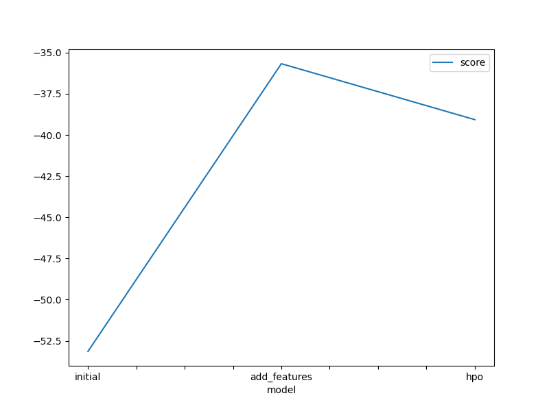
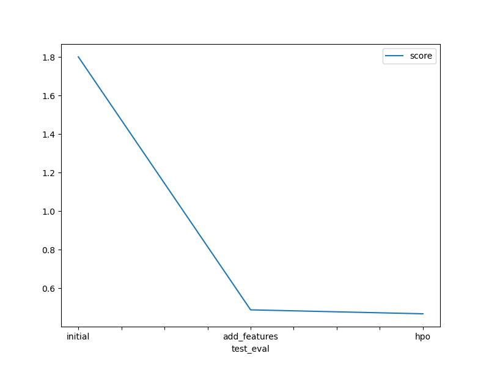

# Report: Predict Bike Sharing Demand with AutoGluon Solution
#### Name: Ahmed Mohmaed Abdelgelel

## Initial Training
### What did you realize when you tried to submit your predictions? What changes were needed to the output of the predictor to submit your results?
when i tried to submit results to kaggle i realized that kaggle doesn't accept negative values so i need to change negative values to zero 

### What was the top ranked model that performed?
WeightedEnsemble_L3

## Exploratory data analysis and feature creation
### What did the exploratory analysis find and how did you add additional features?

i change datetime from int64 to datetime to parse it to monht and day and hour
then change season and weather to category datatype

### How much better did your model preform after adding additional features ?

after addind new features the rerun the model score change from `1.80043` TO  `0.48829`

## Hyper parameter tuning

### Create a table with the models you ran, the hyperparameters modified, and the kaggle score.
| model        | hpo1                                                                                                                                                                             | hpo2                                                                                                                                   | hpo3                                                                                                                                                                                                                        |   score |
|:-------------|:---------------------------------------------------------------------------------------------------------------------------------------------------------------------------------|:---------------------------------------------------------------------------------------------------------------------------------------|:----------------------------------------------------------------------------------------------------------------------------------------------------------------------------------------------------------------------------|--------:|
| initial      | default                                                                                                                                                                          | default                                                                                                                                | default                                                                                                                                                                                                                     | 1.80043 |
| add_features | default                                                                                                                                                                          | default                                                                                                                                | default                                                                                                                                                                                                                     | 0.48829 |
| hpo          | gbm_options = num_boost_round: space.Int(lower=100, upper=500, default=100),num_leaves: space.Int(lower=6, upper=10, default=36), learning_rate: space.Real(0.01, 0.3, log=True) | cat_boost_options = learning_rate: space.Real(1e-4, 1e-2, default=5e-4, log=True),iterations:10000,depth: space.Int(lower=6, upper=10) | xgb_options = n_estimators': space.Int(lower=100, upper=500, default=100), eta: space.Real(1e-4, 1e-2, default=0.3, log=True),'max_depth': space.Int(lower=6, upper=10, default=6), gamma: space.Real(0.09, 0.5, default=0) | 0.46784 |

### Create a line plot showing the top model score for the three (or more) training runs during the project.

### Create a line plot showing the top kaggle score for the three (or more) prediction submissions during the project.

